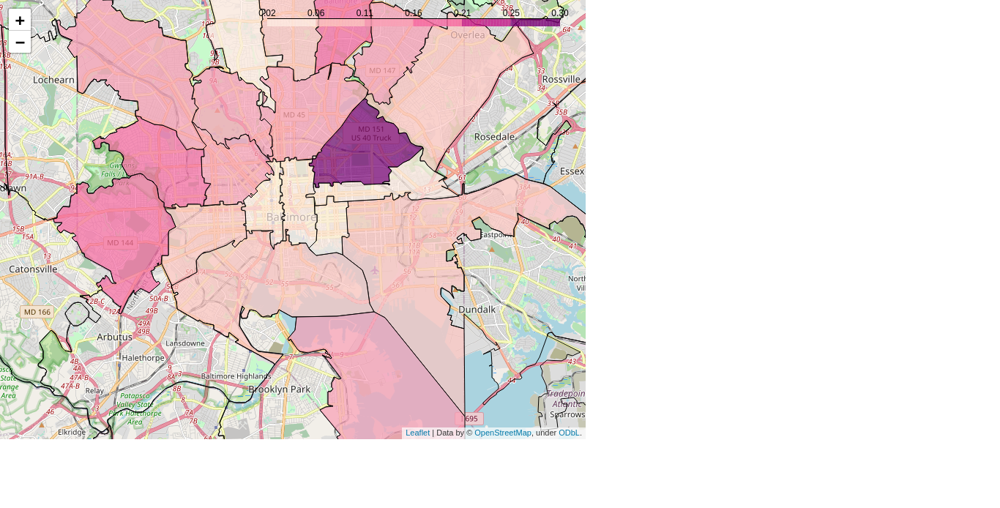

# Quick Links
 - [Project Notebook](code/notebook.ipynb)
 - [Non-Technical Presentation Deck](presentation/presentation.pdf)
 - [Website and blog](https://sethchart.com)
 - [LinkedIn](https://www.linkedin.com/in/sethchart)
 - [Twitter](https://twitter.com/sethchart)

# Outline

For this project, we imagine that an individual is moving the city of Baltimore, Maryland. They plan to buy a residential property somewhere within city limits and live there for two years. After two years have passed they plan to sell their property and move to a new city. They want to restrict their search for a property to five zip codes that have the highest expected return on investment for buying, holding for two years, and then selling a residential property.

We will use Seasonal AutoRegressive Moving Average (SARIMA) models to forecast median sale price for residential properties by zip code. We train our models on Zillow's Home Value Index for single family homes reporting values up to 2020-10-31.

Since we want to identify the five best zip codes for our client, we need to forecast an expected median sale price for single family homes, for each zip code in the city of Baltimore. The historical data contains data for twenty zip codes in the city of Baltimore. That means that we will need to fit twenty SARIMA models and evaluate return on investment for based on their forecasts.

To keep out analysis organized and maximize re-usability of our code, we have decided to build a class that wraps a nested dictionary which will contain all of the objects needed for our analysis. Essentially, we build a collection of helper functions that execute all of the steps of our analysis for a single zip code, store the more computationally expensive outputs of our analysis in a dictionary, then collect all of our individual zip code level analyses into an outer dictionary which provides all of the information needed for our city-wide analysis. The precise data structure is not important, since we have provided methods that access all of required information for our analysis.

# Conclusion

 - By developing our analysis at the zip code level and wrapping our city-wide model in a class with high level methods, we have made the complex structure of our model accessible and easy to work with, keeping most of the complexity encapsulated within the class.
 - Our approach is portable and scalable. The model can be applied directly to any locality where Zillow data is available, and the only limiting factor for the number of zip codes included is computational resources.

# Recommendation

We have successfully identified 21213, 21229, 21216, 21239, and 21226 as the best five zip codes for our client's needs. 
| Zip Code | Return on Investment |
|---|---|

